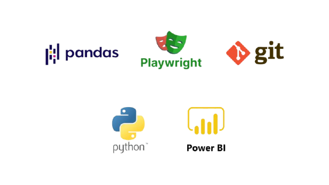
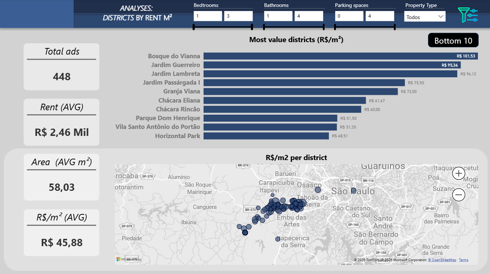
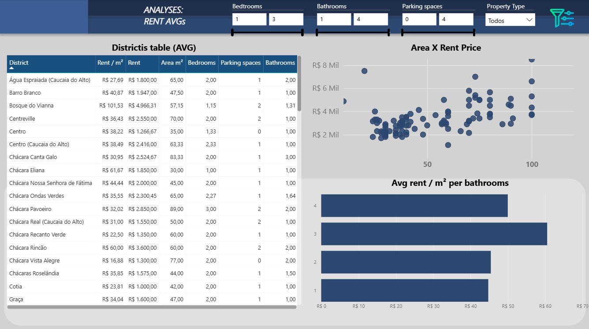

# 🏠 Real Estate Rental Analysis

An end-to-end Data Engineering project that automates the collection of rental property data from ZAP Imóveis, processes the data using Python, and presents insights through an interactive Power BI dashboard.

---

## 🛠️ Tech Stack

<p align="center">
    
</p>

## 📖 Overview

This project was developed to demonstrate a complete data pipeline:

- Data extraction using Playwright
- Data cleaning and transformation with Pandas
- Feature engineering
- Interactive dashboard creation using Power BI

The project focuses on rental properties located in the western metropolitan region of São Paulo.

---

## Why I built this project

I wanted to create a complete end-to-end data engineering project, covering the entire workflow from data extraction to interactive visualization. The project demonstrates skills in web scraping, data transformation, feature engineering, and business intelligence.

## 📊 Dashboard

### Executive Overview



Main indicators:

- Total listings
- Average Rent
- Average Area
- Average Rent/m²
- Top 10 districts by Rent/m²
- Interactive map

---

### District Analysis



This page includes:

- District comparison table
- Scatter plot (Area × Rent)
- Average Rent/m² by number of bathrooms
- Interactive filters

---

## ⚙️ Data Pipeline

```text
           ZAP Imóveis
                 │
                 ▼
          Playwright Scraper
                 │
                 ▼
        Data Cleaning (Pandas)
                 │
                 ▼
       Feature Engineering
                 │
                 ▼
          CSV Dataset
                 │
                 ▼
         Power BI Dashboard
```

---

## 📂 Project Structure

```text
real-estate-rental-analysis/
│
├── main.py
├── scraper.py
├── pipeline.py
├── data_engineering.py
├── requirements.txt
│
├── images/
│   ├── dashboard_page1.png
│   └── dashboard_page2.png
│
└── data/
    └── rental_data.xlsx
```

---

## 🚀 Running the project

Clone the repository

```bash
git clone https://github.com/your-user/real-estate-rental-analysis.git
```

Install dependencies

```bash
pip install -r requirements.txt
```

Run the scraper

```bash
python main.py
```

---

## 📈 Features

✔ Web scraping with Playwright

✔ Modular project structure

✔ Data cleaning

✔ Feature engineering

✔ CSV export

✔ Power BI Dashboard

✔ Interactive filtering

---

## 💡 Skills Demonstrated

- Python
- Web Scraping
- Data Engineering
- ETL
- Pandas
- Data Cleaning
- Power BI
- Git & GitHub

---

## 🔮 Future Improvements

- PostgreSQL integration
- Docker support
- Automatic scheduled scraping
- Cloud deployment
- Power BI automatic refresh

---

## 👨‍💻 Author

Rafael Kobayashi Santos

LinkedIn: *https://www.linkedin.com/in/rafaelkobayashi/*

GitHub: *https://github.com/RafaelKobayashiSantos*